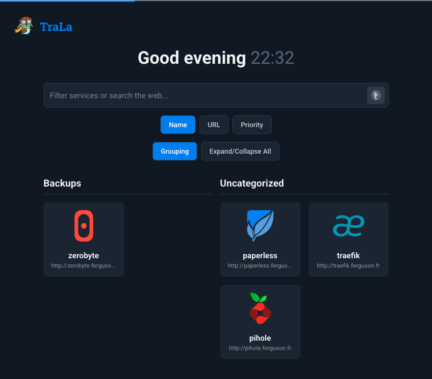

# Compositions

A suite of docker compose projects to spin up locally hosted services.

* /trala - simple dashboard
* /pihole - ad blocking dns
* /paperless - document archiving
* /zerobyte - backup

Replacing home.domain with your chosen local domain.
Setup dns in pihole:
* home.domain
* pihole.home.domain
* paperless.home.domain
* trala.home.domain

Everything currently uses http because CBA.

